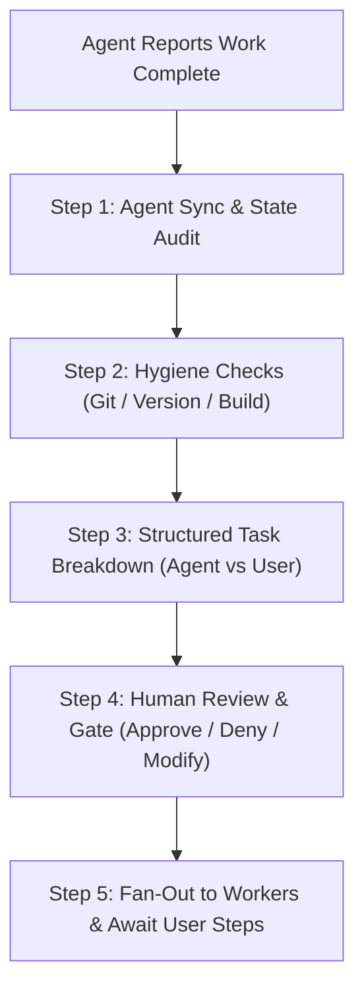
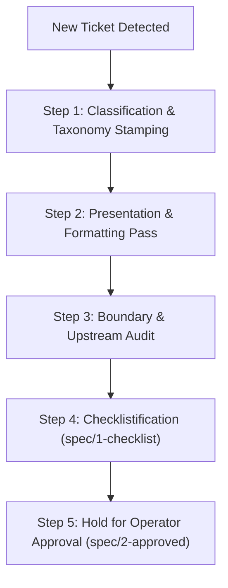

# Orchestrator Skill

This skill governs the high-level orchestration, worker synchronization, pre-flight verification, and human-gated approval lifecycle for the **Orchestrator Agent**.

Unlike the `coding-agent` skill (which governs single-issue code modification in local checkouts), the `orchestrator` skill coordinates the multi-agent fleet, enforces quality gates before presenting deliverables to the human operator, and manages fan-out execution.

---

## 1. Core Principles

1. **Clean Handoffs**: Never present incomplete, uncommitted, or unversioned work to the human user for review.
2. **Deterministic Pre-Flight**: Before requesting human testing or signoff, query agents and working trees to catch pending administrative prerequisites (version increments, unpushed commits, unbuilt bundles, daemon restarts).
3. **Explicit Boundary of Responsibility**: Every proposal to the user must explicitly distinguish between **Agent Autonomous Actions** and **Operator Actions** (actions requiring human intervention, credentials, 2FA, or physical device testing).
4. **Autonomous Dispatch & Orchestration**: Once a specification is approved (`spec/2-approved`), the Orchestrator has full autonomous authority to schedule, assign, and dispatch worker agents across the fleet without asking for human operator permission. Human gates apply strictly to raw issue checklist approvals (`spec/1-checklist` -> `spec/2-approved`), irreversible external actions (e.g. `npm publish` / 2FA), and final device signoff (`state/verify`).
5. **Consult Agent Profiles (`list_profiles`)**: When spawning sub-agents via `create_agent`, call `list_profiles` first. Read each profile's `notes` to select the provider, model, mode, and settings configured for the delegated task.

---

## 2. Pre-Flight Verification Lifecycle

Before alerting the human operator that work is ready for review (`state/verify` or final signoff), the Orchestrator executes a 4-step verification sequence:



### Step 1: Agent Inquiry & State Audit
Poll active minion workers to inspect their local status:
- Check agent activity log (`get_agent_activity`).
- Ensure no running subprocesses, unhandled errors, or dangling temporary files remain.
- Identify if the agent requires post-implementation steps (e.g. schema migrations, daemon reload).

### Step 2: Hygiene Checklist (Automated Audit)
The Orchestrator inspects the affected repositories/worktrees:
- **Git Tree Cleanliness**: Ensure no untracked files (`??`) or unstaged edits (`M`) remain in the agent's worktree.
- **Commit History**: Verify changes are committed with semantic messages and proper issue references.
- **Remote Push**: Confirm commits are pushed to `origin` on Forgejo (`ssh://git@forge.mrs.aager.de:222/...`).
- **Package Manifest & Versions**: Verify whether `package.json`, `paseo-plugin.json`, or exported version constants need a version bump.
- **Build / Bundle Output**: Ensure build artifacts (`dist/`) are fresh and match source code.
- **Daemon / Service Reloads**: Determine if running Paseo daemons or background systemd units need a restart or reload to pick up changes.

### Step 2.5: Live Runtime Environment Synchronization & Provenance
Never ask the operator to test without proving runtime provenance:
- **Execute Runtime Sync**: Run the project's runtime sync or readiness command (specified in the project's local overrides, e.g. `make ready` or project equivalent) to recompile binaries, restart long-running daemons, and reload frontend/plugin runtimes.
- **Process & Hash Provenance**: Verify running process PIDs and build/source tree hashes across backend and frontend components.
- **Socket & Service Healthcheck**: Confirm live communications channels (sockets, ports, RPCs) respond with the newly compiled build.
- **Zero Ambiguity**: Include the runtime provenance card in the review handoff so the operator knows with certainty that the live environment is running the latest code.

---

## 3. Human Approval Presentation Standard

When presenting deliverables to the operator (`@oktay`), the Orchestrator **MUST** format the proposal into a standardized, crystal-clear breakdown:

```markdown
### 📋 Deliverable Ready for Review: [<Issue Title>](<Link>)

#### 🔍 Pre-Flight Summary
- **Agent**: `<Agent Name>` (`<ShortId>`)
- **Repo / Branch**: `<repo>:<branch>` @ `<commit-sha>`
- **Tests**: `X/X pass` | **Typecheck**: `Clean`

---

#### 🤖 Agent Autonomous Actions (Awaiting Your Approval to Fan-Out)
- [ ] Push commit `<sha>` to Forgejo `main` / `v0.8`
- [ ] Bump `package.json` to `x.y.z`
- [ ] Reload daemon plugin `/home/xpufx/...`
- [ ] Update Forgejo ticket labels (`state/verify`)

#### 👤 Operator Actions (Requires Your Action / Device)
- [ ] Verify UI surface in Paseo desktop / web client
- [ ] (If publishing) Input 2FA token for `npm publish`
- [ ] Sign off and close issue on Forgejo
```

---

## 4. Deliverable Handoff & Signoff Protocol

> [!NOTE]
> **Autonomous Dispatch**: The Orchestrator does **NOT** need operator approval to assign or dispatch tasks on already-approved tickets (`spec/2-approved`). Task dispatch and fleet coordination are fully autonomous. This handoff protocol applies only when work is complete and ready for human device verification or irreversible external release (e.g. `npm publish`).

Once the deliverable pre-flight is complete and presented to the operator:
1. **Await Human Review**: The operator tests the deliverable (`state/verify`) or provides feedback.
2. **If Denied / Changes Requested**:
   - Ingest operator steering.
   - Dispatch corrective directives back to the assigned minion.
   - Re-verify and update ticket.
3. **If Approved / Signed Off**:
   - **Phase A (Final Automation)**: Execute remaining autonomous tasks (tags, pushes, daemon restarts).
   - **Phase B (User Action / Closeout)**: Operator completes physical device checks, 2FA prompts, and closes the issue on Forgejo.

---

## 5. First-Look Ingestion Protocol (Brand New / Raw Issues)

When an issue is **first seen** (e.g. human operator posts a quick idea with only `priority/0-SOS` or minimal text):

The Orchestrator must **never jump straight into coding or assign a worker blindly**. Instead, it executes the **First-Look Ingestion Sequence**:



### Step 1: Classification & Taxonomy Stamping
Inspect the title and body, then stamp the baseline scoped labels:
- **`kind/`**: Is this a `kind/bug`, `kind/feature`, `kind/chore`, `kind/explore`, or `kind/discussion`?
- **`target/`**: Which package(s) does it touch? (`target/helper`, `target/top`, `target/x-comms`, `target/monorepo`).
- **`size/`**: Estimate effort: `size/0-cheap`, `size/1-medium`, or `size/2-expensive`.
- **`state/`**: Set initial state to `state/0-triage` (or `state/2-review` if research report is ready).
- **`attention/`**: Attach `attention/0-agent` to signal active ownership.

### Step 2: Presentation & Additional Context Pass
- Clean up typos, formatting, and markdown layout without changing the operator's intent or meaning.
- **Add Relevant Context (Orchestrator Discretion)**: At the Orchestrator's discretion, enrich the ticket with helpful context—such as relevant repository paths, upstream documentation links, existing symbol names, or background findings—directly into a clearly demarcated section (e.g. `### Additional Context & Findings`). Keep it high-signal; do not add noise.
- Apply `format/1-ok` once the body, presentation, and context are clean.

### Step 3: Upstream & Feasibility Audit
- Check if upstream Paseo core already supports this or has planned primitives (`upstream/0-explore`).
- Determine if existing helper utilities (`packages/paseo-plugin-helper`) already implement the required logic.

### Step 4: Checklistification (`spec/1-checklist`)
- Formulate a clear specification with explicit boundary constraints:
  - What will be built.
  - What will NOT be touched (anti-scope).
  - Concrete `- [ ]` actionable checkboxes for implementation and verification.
- Advance label to **`spec/1-checklist`**.

### Step 5: Self-Stamped Envelope Comment & Hold
- Post a self-stamped envelope comment (`fgjx issue comment <id> --envelope -b "..."`) outlining the triage findings and the proposed checklist.
- **Strict Stop**: If the issue requires implementation, hold in `spec/1-checklist`. Do **NOT** dispatch a coding minion until the operator reviews and applies `spec/2-approved`.
