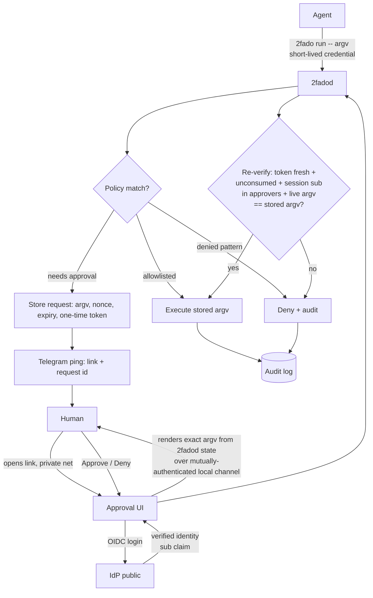

# 2fado — general spec (v0, everything pivotable)

> Note (2026-09): pre-PoC research, superseded by the working Go PoC
> (`docs/poc.md`, `docs/backend-cli.md`). Kept for history; not the
> current plan.

Personal-use project. Preference ladder: single tool that does it all >
compose existing tools > small glue script > build it ourselves (last resort).

## Problem

Agents need root sometimes. NOPASSWD is surrender, passwords-in-files are
theater, interactive 2FA kills autonomy. Goal: routine escalations self-serve
under policy, novel ones wait for a human, everything audited.

`sudo` is out of the picture: the agent invokes `2fado run -- <argv>` and the
2fado daemon (`2fadod`) is the privileged executor. (PAM is not involved; there
is no password anywhere in the design.)

## Actors

- **Agent** — wants to run a privileged command. Authenticates to `2fadod`
  with short-lived material (SSH cert / ephemeral credential). Never holds a
  static secret.
- **`2fadod`** — our privileged service on the box (root-owned; the agent
  user can neither read its state/keys nor speak for it). Owns: the pending
  request store, the policy engine, one-time approval tokens, execution, and
  the audit log. Listens on localhost only.
- **Human approver** — approves from anywhere via the approval UI. Holds no
  crypto keys; identity comes from SSO.
- **IdP** (Authentik / Authelia / Rauthy — TBD, public-facing) — attests *who*.
- **Approval UI** — tiny custom web app on the **private network**, gated by
  the IdP. Renders pending requests from `2fadod` state, collects verdicts.
- **Telegram bot** — pager only. "Request `a3f9` pending, here's the link."
  Zero authority.

## Initial flow

Risk tiers (policy): **auto** (pinned allowlist, no human) / **tap**
(human approval via UI, the common pend case) / **keyboard** (scary patterns:
never single-step approvable — deny, or approve-and-hold with execute-notice
+ cancel window).

## Principles

1. **The `htop`/`rm` swap shall not exist.** The chain box-state → human
   eyeballs is tamper-evident end to end: `2fadod` ↔ UI backend over a
   mutually-authenticated local channel (pinned credential, not
   "localhost therefore fine"); the UI renders exactly that; the verdict
   references request-id + nonce, never a command string. Anything altered in
   transit resolves to nothing approvable. Display integrity is a requirement.
2. **Fail closed.** Any error, timeout, missing policy, expired/consumed
   token, unreadable config, full disk → deny.
3. **Exact match, checked live.** Allowlists are full-argv matches; the allow
   decision compares the argv being executed against the stored argv at
   decision time (no TOCTOU).
4. **Telegram is a pager.** A compromised bot token buys spam, nothing else.
   No approvals forgeable, no commands executable from chat.
5. **The web UI is a crypto client and must act like one** (good libraries,
   never hand-rolled JWT parsing): OIDC code flow + PKCE + `state` + `nonce`;
   validate `id_token` signature against IdP JWKS, plus `iss`/`aud`/`exp`/
   `nonce`; pin the issuer. **Id attestation at decision time, not login
   time** — approver membership re-checked per verdict against the freshly
   validated `sub`. Verdict POSTs carry CSRF + the one-time request token,
   consumed atomically, bound to the session `sub`, logged (who/what/when).
   Short-lived HttpOnly/Secure/SameSite session cookies; step-up re-auth for
   the keyboard tier where the IdP supports it.
6. **First factor is never a password.** Short-lived, centrally revokable
   agent credentials with minutes-long validity.
7. **Transport assumed insecure.** Every security property must hold with an
   adversary reading (and, outside the UI channel, rewriting) traffic.

## Open decisions

- IdP seat: Authentik vs Authelia (vs Rauthy-as-IdP).
- Agent first factor: step-ca SSH certs vs Rauthy ephemeral passwords
  (note: dashboard-minted only — see options) vs other.
- Policy format (allowlist syntax, tier definitions).
- `2fado run` executor semantics (env scrubbing, cwd, stdin, tty).
- Whether a middle "tap" tier exists in Telegram at all, or pend always
  means the full UI.
